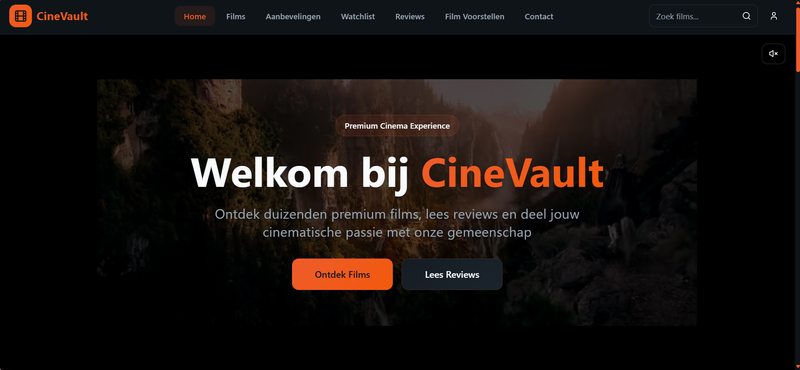
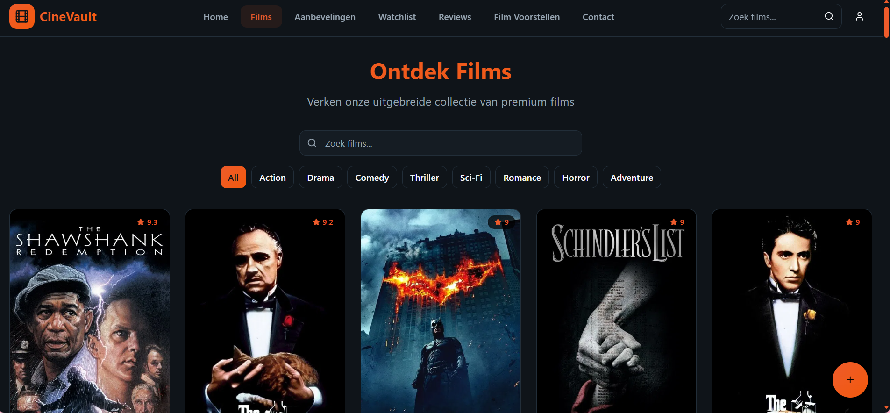
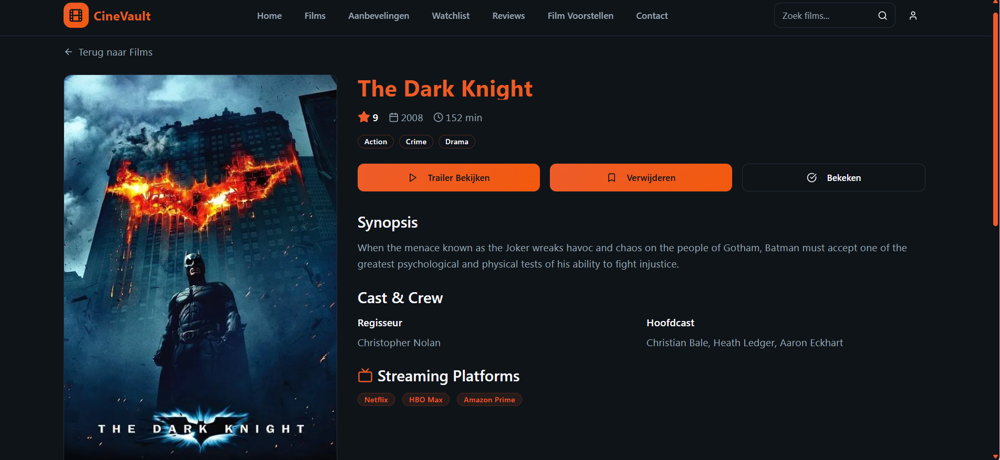
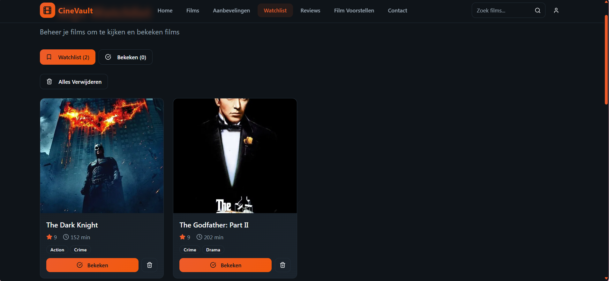

# 🎬 Eigen Film - Premium Film Experience

[](https://reactjs.org/)
[](https://www.typescriptlang.org/)
[](https://vitejs.dev/)
[](https://tailwindcss.com/)
[](https://opensource.org/licenses/MIT)

A modern, responsive film website built with React, TypeScript, and Tailwind CSS. Discover thousands of movies, manage your watchlist, and get personalized recommendations in a beautiful cinematic interface.

## 📖 Table of Contents

- [Features](#-features)
- [Demo](#-demo)
- [Installation](#-installation)
- [Usage](#-usage)
- [Project Structure](#-project-structure)
- [Tech Stack](#-tech-stack)
- [Configuration](#-configuration)
- [Deployment](#-deployment)
- [Contributing](#-contributing)
- [Troubleshooting](#-troubleshooting)
- [Changelog](#-changelog)
- [License](#-license)
- [Support](#-support)

## ✨ Features

### 🎯 Core Functionality
- **Movie Database** - 50+ premium films with posters and trailers
- **Personal Watchlist** - Save movies to watch later
- **Watched Movies** - Track which movies you've already seen
- **Smart Recommendations** - Discover new movies based on your preferences
- **Streaming Information** - See directly where movies are available to watch

### 🎨 UI/UX Features
- **Modern Design** - Dark cinematic theme with orange accents
- **Responsive Layout** - Works perfectly on desktop, tablet, and mobile
- **Smooth Animations** - Hover effects and transitions using Framer Motion
- **Interactive Elements** - Clickable movie posters and buttons

### 🔍 Search & Filter
- **Search Functionality** - Search by title or director
- **Genre Filters** - Filter by movie genre
- **Rating Filters** - Set minimum rating
- **Duration Filters** - Set maximum movie duration

### 🎥 Movie Details
- **Trailer Modal** - YouTube trailers in fullscreen modal
- **Streaming Platforms** - Directly see where movies are available to stream
- **Cast & Crew Info** - Director and main cast details
- **Movie Metadata** - Rating, year, duration, and genres

### 👤 User Experience
- **Authentication** - Supabase Auth for login/register
- **Review System** - Write and read movie reviews
- **Contact Form** - Contact us via Formspree
- **LocalStorage** - Data persists between sessions

## 🎥 Demo

### 📱 Screenshots

#### Homepage


#### Movies Overview


#### Movie Details


#### Watchlist


### 📹 Live Demo
> **Note**: Add a link to your live demo here once deployed.

### 🎬 How to Take Screenshots
To add screenshots to your README:

1. **Take screenshots** of your main pages:
   - Homepage (hero section)
   - Movies listing page
   - Individual movie detail page
   - Watchlist page
   - Any other important features

2. **Save them** in the `public/screenshots/` directory:
   ```bash
   # Example filenames:
   homepage.png
   movies.png
   movie-detail.png
   watchlist.png
   ```

3. **Update the paths** in this README to match your actual screenshot filenames

4. **Recommended screenshot dimensions**: 1200x800px or 1600x900px for best quality

## 🚀 Installation

### Prerequisites

Before you begin, ensure you have the following installed:
- [Node.js](https://nodejs.org/) (version 18.0.0 or higher)
- [npm](https://www.npmjs.com/) (comes with Node.js) or [yarn](https://yarnpkg.com/)
- [Git](https://git-scm.com/)

### Step-by-Step Installation

1. **Clone the repository**
   ```bash
   git clone https://github.com/yourusername/eigen-film-website.git
   cd eigen-film-website/cinematic-craft
   ```

2. **Install dependencies**
   ```bash
   npm install
   # or
   yarn install
   ```

3. **Set up environment variables**
   ```bash
   # Create a .env file in the root directory
   cp .env.example .env
   ```
   
   Fill in your environment variables:
   ```env
   # Supabase (for authentication)
   VITE_SUPABASE_URL=your_supabase_url
   VITE_SUPABASE_ANON_KEY=your_supabase_anon_key
   
   # Formspree (for contact form)
   VITE_FORMSPREE_ID=your_formspree_id
   ```

4. **Start the development server**
   ```bash
   npm run dev
   # or
   yarn dev
   ```

5. **Open your browser**
   Navigate to `http://localhost:5173` to see your application running.

## 💻 Usage

### Basic Usage

Once the application is running, you can:

1. **Browse Movies**: Navigate to the Movies page to see all available films
2. **Search**: Use the search bar to find specific movies
3. **Filter**: Apply genre, rating, or duration filters
4. **Add to Watchlist**: Click the bookmark icon to save movies
5. **Watch Trailers**: Click on movie posters to view trailers
6. **Read Reviews**: Browse and write movie reviews

### Code Examples

#### Adding a Movie to Watchlist
```typescript
import { useWatchlist } from '../hooks/useWatchlist';

const MovieCard = ({ movie }) => {
  const { addToWatchlist, removeFromWatchlist, isInWatchlist } = useWatchlist();
  
  const handleToggleWatchlist = () => {
    if (isInWatchlist(movie.id)) {
      removeFromWatchlist(movie.id);
    } else {
      addToWatchlist(movie);
    }
  };
  
  return (
    <button onClick={handleToggleWatchlist}>
      {isInWatchlist(movie.id) ? 'Remove from Watchlist' : 'Add to Watchlist'}
    </button>
  );
};
```

#### Searching Movies
```typescript
import { useState } from 'react';
import { searchMovies } from '../services/tmdb';

const SearchComponent = () => {
  const [query, setQuery] = useState('');
  const [results, setResults] = useState([]);
  
  const handleSearch = async (searchQuery: string) => {
    if (searchQuery.trim()) {
      const searchResults = await searchMovies(searchQuery);
      setResults(searchResults);
    }
  };
  
  return (
    <div>
      <input
        type="text"
        value={query}
        onChange={(e) => setQuery(e.target.value)}
        placeholder="Search for movies..."
      />
      <button onClick={() => handleSearch(query)}>Search</button>
      
      {results.map(movie => (
        <div key={movie.id}>{movie.title}</div>
      ))}
    </div>
  );
};
```

## 📁 Project Structure

```
cinematic-craft/
├── public/                    # Static assets
│   ├── favicon.svg           # Custom film-themed favicon
│   ├── placeholder.svg       # Placeholder for movie posters
│   └── audio/               # Audio files
├── src/
│   ├── components/           # React components
│   │   ├── ui/              # Shadcn/ui components
│   │   ├── Navbar.tsx       # Navigation component
│   │   ├── Footer.tsx       # Footer component
│   │   ├── CinematicIntro.tsx # Hero section component
│   │   └── AddMovieForm.tsx # Movie addition form
│   ├── pages/                # Page components
│   │   ├── Index.tsx        # Homepage with hero video
│   │   ├── Movies.tsx       # All movies overview
│   │   ├── MovieDetail.tsx  # Individual movie page
│   │   ├── Recommendations.tsx # Smart recommendations
│   │   ├── Watchlist.tsx    # Personal watchlist
│   │   ├── Reviews.tsx      # Movie review system
│   │   ├── Account.tsx      # User authentication
│   │   ├── Contact.tsx      # Contact form
│   │   └── Search.tsx       # Search results
│   ├── data/                 # Data files
│   │   └── movies.ts        # Movie database (50+ movies)
│   ├── lib/                  # Utility libraries
│   │   ├── supabaseClient.ts # Supabase configuration
│   │   └── utils.ts         # Utility functions
│   ├── hooks/                # Custom React hooks
│   │   ├── use-mobile.tsx   # Mobile detection hook
│   │   └── use-toast.ts     # Toast notification hook
│   ├── services/             # API services
│   │   └── tmdb.ts          # TMDb API integration
│   ├── App.tsx              # Main app component
│   ├── main.tsx             # Entry point
│   ├── App.css              # Global styles
│   └── index.css            # Tailwind CSS imports
├── package.json              # Dependencies and scripts
├── tailwind.config.ts       # Tailwind configuration
├── vite.config.ts           # Vite configuration
├── tsconfig.json            # TypeScript configuration
└── README.md                # This file
```

## 🛠️ Tech Stack

### Frontend Framework
- **React 18.3.1** - Modern UI library with hooks
- **TypeScript 5.5.3** - Type-safe development
- **Vite 5.4.1** - Fast build tool and dev server

### Styling & UI
- **Tailwind CSS 3.4.11** - Utility-first CSS framework
- **Shadcn/ui** - Modern, accessible UI components
- **Lucide React 0.462.0** - Beautiful icon library
- **Framer Motion 12.23.12** - Smooth animations

### State Management & Data
- **React Hooks** - useState, useEffect, useContext
- **LocalStorage** - Persistent data storage
- **Supabase 2.53.0** - Authentication and database
- **React Query 5.56.2** - Data fetching and caching

### Development Tools
- **ESLint 9.9.0** - Code linting and quality
- **TypeScript 5.5.3** - Static type checking
- **PostCSS 8.4.47** - CSS processing
- **Autoprefixer 10.4.20** - CSS vendor prefixes

## ⚙️ Configuration

### Environment Variables

Create a `.env` file in the root directory:

```env
# Supabase Configuration
VITE_SUPABASE_URL=https://your-project.supabase.co
VITE_SUPABASE_ANON_KEY=your_supabase_anon_key

# Formspree Configuration
VITE_FORMSPREE_ID=your_formspree_id

# TMDb API (optional)
VITE_TMDB_API_KEY=your_tmdb_api_key
```

### Tailwind Configuration

```typescript
// tailwind.config.ts
import type { Config } from 'tailwindcss'

export default {
  content: [
    "./index.html",
    "./src/**/*.{js,ts,jsx,tsx}",
  ],
  theme: {
    extend: {
      colors: {
        primary: "hsl(15 85% 55%)",
        secondary: "hsl(0 0% 100%)",
        background: "hsl(0 0% 3.9%)",
        foreground: "hsl(0 0% 98%)",
      },
      fontFamily: {
        sans: ['Inter', 'sans-serif'],
      },
    },
  },
  plugins: [require("tailwindcss-animate")],
} satisfies Config
```

### Vite Configuration

```typescript
// vite.config.ts
import { defineConfig } from 'vite'
import react from '@vitejs/plugin-react-swc'

export default defineConfig({
  plugins: [react()],
  server: {
    port: 5173,
    open: true,
  },
  build: {
    outDir: 'dist',
    sourcemap: true,
  },
})
```

## 🚀 Deployment

### Vercel (Recommended)

1. **Install Vercel CLI**
   ```bash
   npm i -g vercel
   ```

2. **Deploy**
   ```bash
   npm run build
   vercel --prod
   ```

### Netlify

1. **Build the project**
   ```bash
   npm run build
   ```

2. **Deploy to Netlify**
   - Drag and drop the `dist/` folder to Netlify
   - Or connect your GitHub repository for automatic deployments

### GitHub Pages

1. **Build the project**
   ```bash
   npm run build
   ```

2. **Deploy to GitHub Pages**
   ```bash
   # Add this to package.json scripts
   "deploy": "gh-pages -d dist"
   
   # Then run
   npm run deploy
   ```

## 🤝 Contributing

We welcome contributions! Please follow these steps:

### 1. Fork the Repository
```bash
git clone https://github.com/yourusername/eigen-film-website.git
cd eigen-film-website
```

### 2. Create a Feature Branch
```bash
git checkout -b feature/AmazingFeature
# or
git checkout -b fix/BugFix
```

### 3. Make Your Changes
- Write clean, readable code
- Follow the existing code style
- Add tests if applicable
- Update documentation as needed

### 4. Commit Your Changes
```bash
git add .
git commit -m 'Add: AmazingFeature description'
```

### 5. Push and Create Pull Request
```bash
git push origin feature/AmazingFeature
```

### 6. Code Style Guidelines
- Use TypeScript for all new code
- Follow ESLint rules
- Use Prettier for formatting
- Write meaningful commit messages

## 🔧 Troubleshooting

### Common Issues and Solutions

#### 1. Build Errors
**Problem**: `npm run build` fails
**Solution**: 
```bash
# Clear node_modules and reinstall
rm -rf node_modules package-lock.json
npm install
```

#### 2. Development Server Won't Start
**Problem**: Port 5173 is already in use
**Solution**:
```bash
# Kill the process using the port
npx kill-port 5173
# Or change the port in vite.config.ts
```

#### 3. TypeScript Errors
**Problem**: TypeScript compilation errors
**Solution**:
```bash
# Check TypeScript configuration
npx tsc --noEmit
# Fix type issues or update types
```

#### 4. Styling Issues
**Problem**: Tailwind CSS not working
**Solution**:
```bash
# Rebuild Tailwind CSS
npx tailwindcss -i ./src/index.css -o ./dist/output.css --watch
```

#### 5. Environment Variables Not Loading
**Problem**: Environment variables undefined
**Solution**:
- Ensure `.env` file is in the root directory
- Restart the development server
- Check that variables start with `VITE_`

### Performance Issues

#### 1. Slow Build Times
- Use `npm run build:dev` for development builds
- Consider using `--mode development` flag

#### 2. Large Bundle Size
- Analyze bundle with `npm run build && npx vite-bundle-analyzer`
- Implement code splitting for routes
- Use dynamic imports for heavy components

## 📝 Changelog

### [Unreleased]
- New features in development
- Bug fixes and improvements

### [0.1.0] - 2024-01-XX
#### Added
- Initial project setup with React + TypeScript + Vite
- Basic movie browsing functionality
- Watchlist management system
- User authentication with Supabase
- Responsive design with Tailwind CSS
- Movie search and filtering
- Trailer modal functionality
- Review system
- Contact form integration

#### Changed
- Updated to React 18.3.1
- Upgraded TypeScript to 5.5.3
- Enhanced UI components with Shadcn/ui

#### Fixed
- Mobile responsiveness issues
- Authentication flow bugs
- Search functionality improvements

## 📄 License

This project is licensed under the MIT License - see the [LICENSE](LICENSE) file for details.

```
MIT License

Copyright (c) 2024 Eigen Film

Permission is hereby granted, free of charge, to any person obtaining a copy
of this software and associated documentation files (the "Software"), to deal
in the Software without restriction, including without limitation the rights
to use, copy, modify, merge, publish, distribute, sublicense, and/or sell
copies of the Software, and to permit persons to whom the Software is
furnished to do so, subject to the following conditions:

The above copyright notice and this permission notice shall be included in all
copies or substantial portions of the Software.

THE SOFTWARE IS PROVIDED "AS IS", WITHOUT WARRANTY OF ANY KIND, EXPRESS OR
IMPLIED, INCLUDING BUT NOT LIMITED TO THE WARRANTIES OF MERCHANTABILITY,
FITNESS FOR A PARTICULAR PURPOSE AND NONINFRINGEMENT. IN NO EVENT SHALL THE
AUTHORS OR COPYRIGHT HOLDERS BE LIABLE FOR ANY CLAIM, DAMAGES OR OTHER
LIABILITY, WHETHER IN AN ACTION OF CONTRACT, TORT OR OTHERWISE, ARISING FROM,
OUT OF OR IN CONNECTION WITH THE SOFTWARE OR THE USE OR OTHER DEALINGS IN THE
SOFTWARE.
```

## 🙏 Acknowledgments

- **TMDb** - For movie posters and metadata
- **YouTube** - For movie trailers
- **Supabase** - For authentication and database services
- **Shadcn/ui** - For beautiful UI components
- **Tailwind CSS** - For the utility-first CSS framework
- **Vite** - For the fast build tool
- **React Team** - For the amazing React library

## 📞 Support

Need help? Here's how to get support:

### 📧 Email Support
- **General Inquiries**: rochellemannie2003@outlook.com
- **Technical Support**: rochellemannie2003@outlook.com

### 🐛 Bug Reports
- Create an issue on [GitHub Issues](https://github.com/yourusername/eigen-film-website/issues)
- Include detailed steps to reproduce the problem
- Add screenshots if applicable

### 💡 Feature Requests
- Use the [GitHub Issues](https://github.com/yourusername/eigen-film-website/issues) page
- Describe the feature and its benefits
- Consider contributing the feature yourself

### 📚 Documentation
- Check this README first
- Review the code comments
- Look at existing issues for similar problems

---

**Made with ❤️ for movie lovers worldwide** 🎬✨

*If you find this project helpful, please give it a ⭐ on GitHub!*
